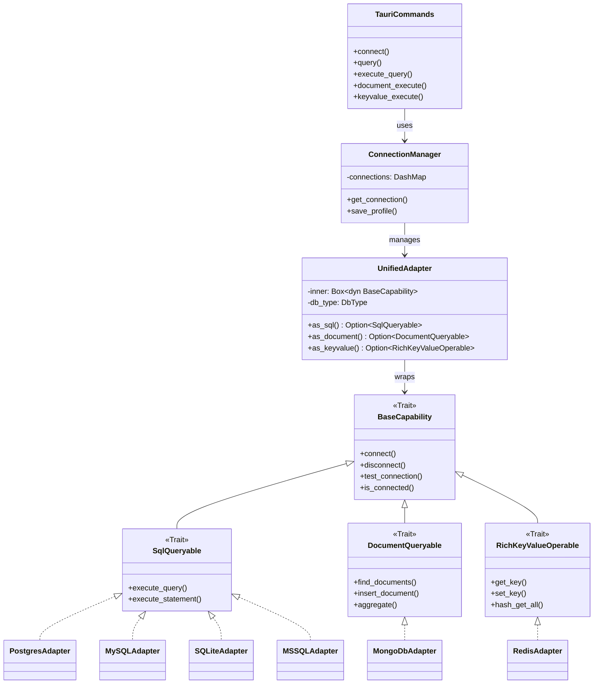
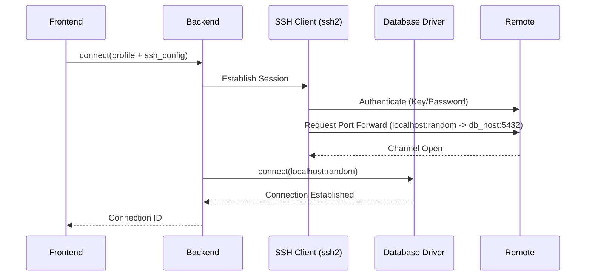
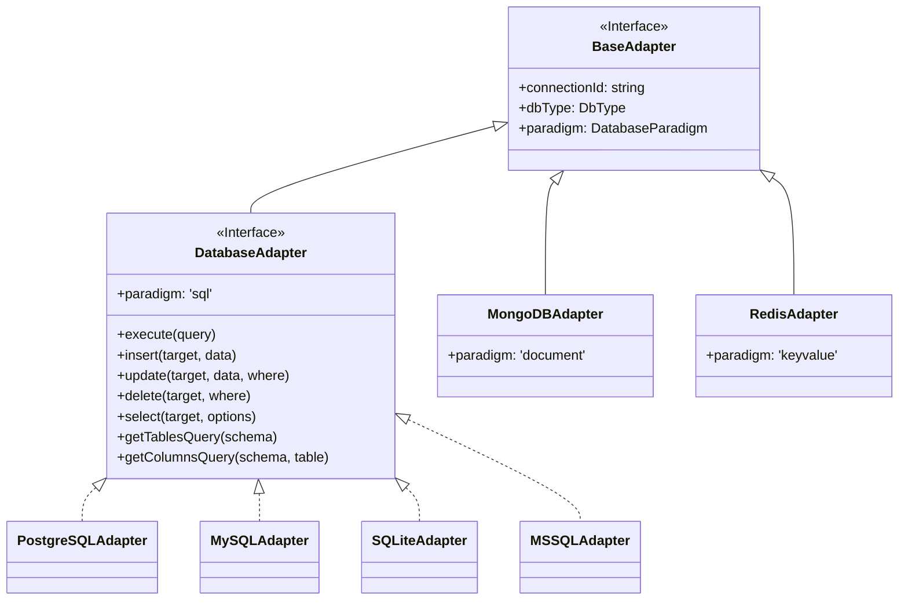

# Query Pilot Backend API Specification

This document provides comprehensive API documentation for the core Tauri commands exposed by the Query Pilot Rust backend.

## Overview

The backend exposes a minimal set of powerful commands. Unlike traditional architectures that expose specific methods for every operation (e.g., `get_tables`, `get_users`), Query Pilot uses a **generalized execution model**:

1.  **Direct Query**: For metadata, introspection, and small results (JSON).
2.  **Streaming Query**: For user data, large result sets, and grids (MessagePack).

All database-specific logic (SQL generation) lives in the **Frontend Adapters**. The Backend is a high-performance execution engine.

---

## Connection Management

### `connect`

Establishes or retrieves a database connection using connection pooling.

**Signature:**
```rust
async fn connect(profile: ConnectionProfile) -> Result<ConnectionInfo, String>
```

**Parameters:**
- `profile`: Object containing host, port, credentials, and adapter type.

**Returns:** `ConnectionInfo`
- `id`: Unique connection ID (used for subsequent commands).
- `db_type`: The database type (postgres, mysql, etc.).
- `version`: Server version string.

### `disconnect`

Closes a specific connection and releases resources.

**Signature:**
```rust
async fn disconnect(conn_id: String) -> Result<(), String>
```

### `test_connection`

Tests connectivity without permanently adding to the pool. Use this for the "Test Connection" button in UI.

**Signature:**
```rust
async fn test_connection(profile: ConnectionProfile) -> Result<ConnectionTestResult, String>
```

---

## Query Execution

### `query` (Direct / Path 1)

Executes a SQL statement and returns the full result set as JSON. **Use this for metadata and introspection.**

**Signature:**
```rust
async fn query(conn_id: String, sql: String) -> Result<QueryResult, String>
```

**Use Case:**
- Fetching table lists (`introspectionService`).
- Fetching columns/indexes.
- AI Context generation.

**Returns:**
```json
{
  "columns": [{ "name": "id", "data_type": "Integer", ... }],
  "rows": [
    [{ "display_value": "1", "value_type": "Integer" }, ...],
    ...
  ]
}
```

### `execute_query` (Streaming / Path 2)

Starts a streaming query operation. Results are delivered via IPC channels in batches using MessagePack encoding. **Use this for Data Grids.**

**Signature:**
```rust
async fn execute_query(
    conn_id: String,
    tab_id: String,
    sql: String,
    metadata_channel: Channel,
    data_channel: Channel
) -> Result<(), String>
```

**Parameters:**
- `tab_id`: Unique identifier for the UI tab (allows cancellation).
- `metadata_channel`: Channel for initial columns and row estimates.
- `data_channel`: Channel for binary MessagePack batches.

### `cancel_query`

Cancels a running streaming query.

**Signature:**
```rust
async fn cancel_query(conn_id: String, tab_id: String) -> Result<(), String>
```

---

## System Architecture

### Component Hierarchy



### Database Paradigms

Query Pilot supports three database paradigms:

| Paradigm | Databases | Trait | Commands |
|----------|-----------|-------|----------|
| **SQL** | PostgreSQL, MySQL, MariaDB, SQLite, SQL Server | `SqlQueryable` | `query`, `execute_query` |
| **Document** | MongoDB | `DocumentQueryable` | `document_execute`, `mongo_*` |
| **Key-Value** | Redis | `RichKeyValueOperable` | `keyvalue_execute`, `redis_*` |

## Connection Store & Security

Query Pilot uses a split-storage model for connection profiles to ensure security.

### 1. Metadata Storage (`connections.json`)
Non-sensitive configuration is stored in a JSON file in the user's data directory.
*   **Path:** `~/Library/Application Support/com.querypilot.studio/connections.json` (macOS)
*   **Content:** Host, Port, Username, Database Name, SSL Mode, SSH Config (excluding keys).

### 2. Secure Storage (OS Keychain)
Sensitive credentials are **never** stored in plain text files. They are stored in the operating system's native keychain using the `keyring` crate.
*   **Service Name:** `query-pilot`
*   **Keys:** `password`, `ssh_private_key_passphrase`

### 3. Encryption
When exporting connections, secrets are encrypted using AES-256-GCM derived from a user-provided master password.

## SSH Tunneling

The backend handles SSH tunneling transparently using the `ssh2` crate.



1.  **Session Init:** Backend starts an SSH session to the bastion host.
2.  **Port Forwarding:** A local random port is bound and forwarded to the remote database host.
3.  **Transparent Connection:** The database driver connects to `localhost:<random_port>`, unaware of the tunnel.


---

## Frontend Adapter Architecture

The frontend uses a parallel adapter system that mirrors the backend paradigms.

### Frontend Component Hierarchy



### Adapter Factory

The `getAdapter()` function routes to the correct adapter based on database paradigm:

```typescript
// src/adapters/index.ts
export async function getAdapter(connectionId: string, dbType: DbType): Promise<BaseAdapter> {
  const paradigm = getParadigm(dbType);
  switch (paradigm) {
    case 'sql':     return new SqlAdapter(connectionId);     // PostgreSQL, MySQL, etc.
    case 'document': return new MongoDBAdapter(connectionId); // MongoDB
    case 'keyvalue': return new RedisAdapter(connectionId);   // Redis
  }
}
```

### Type Guards

Use type guards for paradigm-specific operations:

```typescript
import { isSqlAdapter, isDocumentAdapter, isKeyValueAdapter } from '@/adapters/types';

const adapter = await getAdapter(connectionId, dbType);

if (isSqlAdapter(adapter)) {
  const sql = adapter.getTablesQuery(schema);
  // SQL-specific operations
}

if (isDocumentAdapter(adapter)) {
  // MongoDB operations via document_execute command
}

if (isKeyValueAdapter(adapter)) {
  // Redis operations via keyvalue_execute command
}
```

### SQL Adapter Responsibilities

For SQL databases, the frontend adapter is the "brain" that generates all SQL:

| Responsibility | Frontend Adapter | Backend |
|----------------|-----------------|---------|
| SQL Generation | ✅ | ❌ |
| Introspection Queries | ✅ | ❌ |
| DDL Generation | ✅ | ❌ |
| Query Execution | ❌ | ✅ |
| Connection Pooling | ❌ | ✅ |
| Streaming | ❌ | ✅ |

### Document/KeyValue Adapter Responsibilities

For MongoDB and Redis, the frontend adapter is thin - it calls backend commands directly:

| Responsibility | Frontend Adapter | Backend |
|----------------|-----------------|---------|
| Command Dispatch | ✅ | ❌ |
| Operation Logic | ❌ | ✅ |
| Connection Pooling | ❌ | ✅ |
| Streaming | ❌ | ✅ |

---

## Backend Command Organization

Commands are organized by paradigm in `src-tauri/src/commands/`:

```
src-tauri/src/commands/
├── mod.rs          # Re-exports all commands
├── connection.rs   # connect, disconnect, test_connection, ping
├── sql.rs          # query, execute_query, switch_database
├── document.rs     # document_execute, mongo_* commands
└── keyvalue.rs     # keyvalue_execute, redis_* commands
```

---

## Deprecated Commands

The following commands have been **removed** in favor of the Frontend Adapter architecture. The frontend now generates the SQL for these operations and uses `query()` to execute them.

- `get_databases`
- `get_schemas`
- `get_tables`
- `get_views`
- `get_columns`
- `get_indexes`
- `get_constraints`
