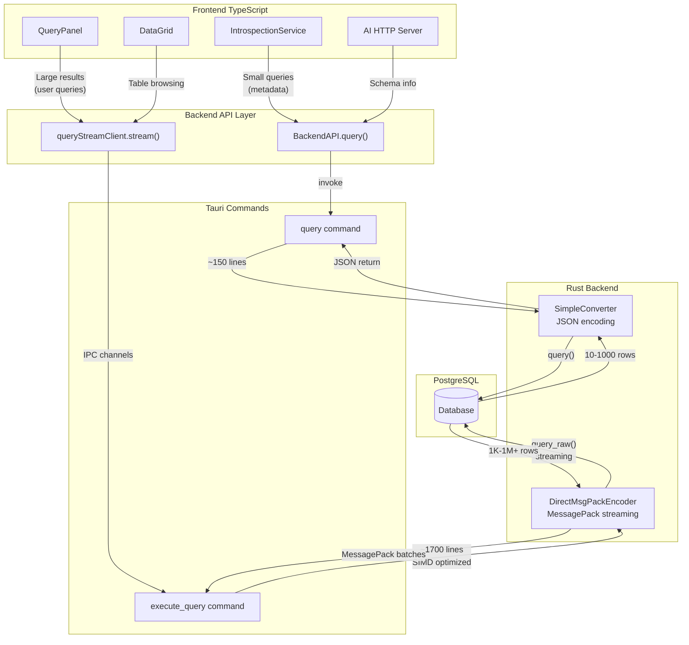
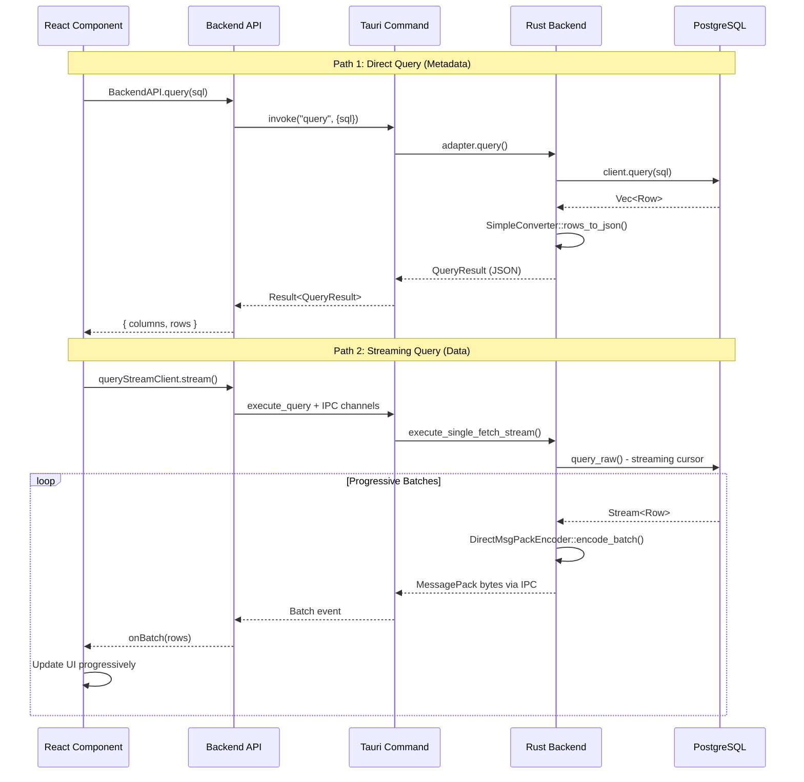

# Query Execution Architecture

## Overview

Query Pilot implements a **dual-path query execution architecture** to optimize for different use cases. Rather than using a one-size-fits-all approach, the system intelligently routes queries through either a simple direct path or a high-performance streaming path based on the expected result size and use case.

This architecture provides:

- **Low latency** for small metadata queries (< 10ms overhead)
- **High throughput** for large result sets (3-5x faster than JSON)
- **Progressive rendering** for better UX on slow connections
- **Cancellable queries** for long-running operations

## Architecture Diagram



## Path 1: Direct Query (SimpleConverter)

### Use Cases

- **Introspection queries**: Schema metadata, table lists, column definitions
- **Constraint queries**: Foreign keys, indexes, triggers, constraints
- **AI HTTP server**: Schema information for AI tools
- **Small result sets**: Any query expected to return < 1000 rows
- **Synchronous operations**: Where you need immediate results without streaming setup

### Performance Characteristics

- **Latency**: ~5-10ms overhead (invoke + JSON parsing)
- **Throughput**: Suitable for up to 1000 rows
- **Memory**: Entire result set loaded into memory at once
- **Complexity**: ~150 lines of simple conversion code

### Code Flow

**Frontend:**

```typescript
// src/services/introspectionService.ts
const adapter = await getAdapterForConnection(connectionId);
// The Frontend Adapter generates the SQL for introspection
const sql = adapter.getTablesQuery(schema);
// We send the raw SQL to the backend
const result = await BackendAPI.query(connectionId, sql);
// result.rows: CellValue[][]
```

**Backend:**

```rust
// src-tauri/src/commands.rs
#[tauri::command]
pub async fn query(
    conn_id: String,
    sql: String, // SQL provided by frontend
    manager: State<'_, Arc<ConnectionManager>>,
) -> Result<QueryResult, String> {
    let conn = manager.get_connection_with_retry(&conn_id, 3).await?;
    // Adapter simply executes the SQL string
    conn.adapter.query(&sql).await
}

// src-tauri/src/adapters/postgres/adapter.rs
async fn query(&self, sql: &str) -> Result<QueryResult> {
    let rows = client.query(sql, &[]).await?;
    let json_rows = SimpleConverter::rows_to_json(&rows);
    Ok(QueryResult { columns, rows: json_rows })
}
```

**Files:**

- Frontend: `src/services/backend.ts` (`BackendAPI.query()`)
- Frontend: `src/services/introspectionService.ts` (primary consumer)
- Rust: `src-tauri/src/commands.rs` (`query` command)
- Rust: `src-tauri/src/adapters/postgres/simple_converter.rs` (JSON encoding)

## Path 2: Streaming Query (DirectMsgPackEncoder)

### Use Cases

- **Data grids**: Table browsing with thousands of rows
- **Query panels**: User-written queries with unknown result sizes
- **CRUD operations**: INSERT/UPDATE/DELETE with RETURNING clauses
- **Large exports**: Any operation that could return > 1000 rows
- **Progressive rendering**: Where you want to show results as they arrive

### Performance Characteristics

- **Latency**: ~50ms initial setup (IPC channels + cursor)
- **Throughput**: 3-5x faster than JSON for large datasets
- **Memory**: Streaming with configurable batch sizes (16-2048 rows)
- **Complexity**: ~1700 lines with SIMD optimizations
- **Cancellable**: Can be interrupted mid-stream

### Code Flow

**Frontend:**

```typescript
// src/services/queryStreamClient.ts
const result = await queryStreamClient.streamWithCallbacks(
  {
    connId: connectionId,
    tabId: "system",
    sql: "SELECT * FROM large_table",
  },
  {
    onBatch: (batch) => {
      // Progressive rendering - rows arrive in batches
      displayRows.push(...batch.rows);
    },
  },
);
```

**Backend:**

```rust
// src-tauri/src/commands.rs
#[tauri::command]
pub async fn execute_query(
    conn_id: String,
    tab_id: String,
    sql: String,
    metadata_channel: tauri::ipc::Channel<StreamMessage>,
    data_channel: tauri::ipc::Channel<tauri::ipc::Response>,
    manager: State<'_, Arc<ConnectionManager>>,
) -> Result<(), String> {
    // Stream rows using query_raw (PostgreSQL cursor)
    let row_stream = pool_conn.query_raw(&stmt, std::iter::empty()).await?;

    // Encode batches with DirectMsgPackEncoder
    let encoder = DirectMsgPackEncoder::from_row(&first_row);
    let msgpack_bytes = encoder.encode_batch(&row_buffer)?;

    // Send via IPC channel (not window.emit - critical for performance)
    data_channel.send(msgpack_bytes)?;
}
```

**Files:**

- Frontend: `src/services/queryStreamClient.ts` (streaming client)
- Frontend: `src/hooks/useTableDataQuery.ts` (React Query integration)
- Rust: `src-tauri/src/commands.rs` (`execute_query` command)
- Rust: `src-tauri/src/adapters/postgres/direct_msgpack.rs` (MessagePack encoding)

## Comparison Table

| Aspect           | Direct Query (SimpleConverter) | Streaming Query (DirectMsgPackEncoder) |
| ---------------- | ------------------------------ | -------------------------------------- |
| **Encoding**     | JSON (serde_json)              | MessagePack (rmp-serde)                |
| **Transport**    | Tauri invoke (return value)    | IPC channels (streaming)               |
| **Batch Size**   | All at once                    | Progressive (16-2048 rows)             |
| **Memory**       | Full result in memory          | Streaming with bounded memory          |
| **Latency**      | ~5-10ms overhead               | ~50ms initial setup                    |
| **Throughput**   | Good for < 1000 rows           | Optimized for 1K-1M+ rows              |
| **Cancellation** | Not supported                  | Supported via channel close            |
| **Code Size**    | ~150 lines                     | ~1700 lines (SIMD optimized)           |
| **Use Case**     | Metadata, introspection        | Data display, user queries             |
| **API Style**    | Synchronous-like (async/await) | Event-driven (callbacks)               |

## Frontend Integration

### When to Use Direct Query

Use `BackendAPI.query()` when:

- Querying system catalogs (information_schema, pg_catalog)
- Expected result size < 1000 rows
- Need simple async/await pattern
- Building HTTP API endpoints
- Result is not user-facing data

**Example:**

```typescript
import { BackendAPI } from "@/services/backend";
import { getAdapterForConnection } from "@/adapters";

// Get table metadata
const adapter = await getAdapterForConnection(connectionId);
const sql = adapter.getColumnsQuery(schema, table);
const result = await BackendAPI.query(connectionId, sql);
// result.rows: CellValue[][]
```

### When to Use Streaming Query

Use `queryStreamClient.stream()` when:

- Displaying data in grids or tables
- Unknown result size (user queries)
- Need progressive rendering
- Want cancellation support
- Result size could be > 1000 rows

**Example:**

```typescript
import { queryStreamClient } from "@/services/queryStreamClient";

// Stream table data
const rows: unknown[][] = [];
const result = await queryStreamClient.streamWithCallbacks(
  {
    connId: connectionId,
    tabId: "query-1",
    sql: "SELECT * FROM users",
  },
  {
    onBatch: (batch) => {
      rows.push(...batch.rows);
      // Update UI progressively
    },
  },
);
```

## Performance Guidelines

### Thresholds

| Result Size   | Recommended Path       | Reasoning                       |
| ------------- | ---------------------- | ------------------------------- |
| < 100 rows    | Either (prefer Direct) | Overhead difference negligible  |
| 100-1000 rows | Either (prefer Direct) | Direct query is simpler         |
| 1K-10K rows   | Streaming              | 2-3x faster with MessagePack    |
| 10K-100K rows | Streaming              | Progressive rendering essential |
| 100K+ rows    | Streaming              | Only viable option              |

### Best Practices

1. **Introspection Always Uses Direct Query**
   - System catalogs return small result sets
   - Simple API is easier to maintain
   - Used by IntrospectionService throughout

2. **User Queries Always Use Streaming**
   - Unknown result size requires streaming
   - Better UX with progressive rendering
   - Cancellation support for long queries

3. **CRUD Operations Use Streaming**
   - Even single-row operations use streaming path
   - Consistent API across all data operations
   - RETURNING clauses may return multiple rows

4. **External Tools Use Direct Query**
   - External processes use `adapter.query()` via commands
   - Cannot use IPC channels from external context
   - Results are typically small (schema info)

### Optimization Tips

**For Direct Query:**

- Add `LIMIT` clauses to bound result size
- Use `COUNT(*)` for existence checks instead of fetching rows
- Batch multiple small queries if possible

**For Streaming Query:**

- Use appropriate batch sizes (default: progressive 16→2048)
- Enable cancellation for long-running queries
- Consider pagination for very large result sets

## Data Flow Diagram



## Migration Guide

If you're adding a new query operation, follow this decision tree:

```
Is this a user-facing data display?
├─ Yes → Use queryStreamClient.stream()
│  └─ Examples: Data grids, query results, table browsing
│
└─ No → Is the result size bounded and small (< 1000 rows)?
   ├─ Yes → Use BackendAPI.query()
   │  └─ Examples: Schema metadata, constraints, system catalogs
   │
   └─ No → Use queryStreamClient.stream()
      └─ Examples: Reports, exports, analytics queries
```

## Troubleshooting

### Query Returns Empty Results

- **Direct Query**: Check SQL syntax, ensure connection is valid
- **Streaming Query**: Check IPC channel setup, verify tab_id is unique

### Performance Issues

- **Direct Query**: If > 1000 rows, switch to streaming
- **Streaming Query**: Adjust batch size, check network latency

### Memory Issues

- **Direct Query**: Result set too large - switch to streaming
- **Streaming Query**: Reduce batch size, implement pagination

## Related Files

**Frontend:**

- `src/services/backend.ts` - BackendAPI.query()
- `src/services/queryStreamClient.ts` - Streaming client
- `src/services/introspectionService.ts` - Metadata queries
- `src/adapters/base/SqlAdapter.ts` - SQL generation
- `src/hooks/useTableDataQuery.ts` - React Query integration

**Backend:**

- `src-tauri/src/commands.rs` - Tauri commands (query, execute_query)
- `src-tauri/src/adapters/postgres/simple_converter.rs` - JSON encoding
- `src-tauri/src/adapters/postgres/direct_msgpack.rs` - MessagePack encoding
- `src-tauri/src/adapters/postgres/adapter.rs` - PostgreSQL adapter

## See Also

- [CLAUDE.md](../CLAUDE.md) - Project architecture overview
- [Query Streaming & Performance](../CLAUDE.md#query-streaming--performance) - Performance optimization details
- [Database Connection Management](../CLAUDE.md#database-connection-management) - Connection pooling
