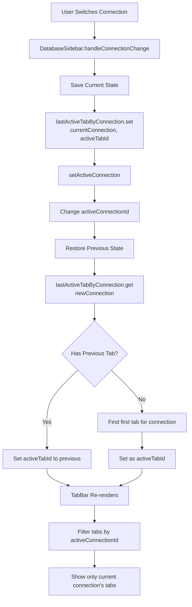

# Connection & Tabs Management Architecture

## Overview
The workspace system manages multiple database connections, each with their own set of tabs. When switching between connections, the system saves the current state and restores the previous state for the target connection.

## Core Components

### 1. Data Structure (`workspaceStore.ts`)
```typescript
WorkspaceStore {
  workspaces: Map<workspaceId, WorkspaceState>
  activeWorkspaceId: string | null
  lastActiveTabByConnection: Map<workspaceId, Map<connectionId, tabId>>
}

WorkspaceState {
  id: string
  activeConnectionId: string | null  // Currently active database
  tabs: Map<tabId, TabState>         // ALL tabs for ALL connections
  tabOrder: string[]                  // Order of tabs
  activeTabId: string | null         // Currently active tab
  connectionIds: string[]             // All connections in workspace
}

TabState {
  id: string
  connectionId: string                // Which connection this tab belongs to
  type: 'query' | 'table' | 'schema'
  payload: {
    sql?: string                     // Query content (auto-saved on change)
    tableName?: string
    schema?: string
  }
  isDirty: boolean
}
```

## Connection Switching Flow



## Tab Lifecycle

### 1. Tab Creation
```typescript
// When user opens a table/query
addTab(workspaceId, {
  type: 'query',
  connectionId: activeConnectionId,  // Tied to current connection
  payload: { sql: '' }
})
```

### 2. Tab Content Persistence
```typescript
// QueryTab.tsx - Auto-saves on every keystroke
handleSqlChange = (value) => {
  setSql(value)
  updateTabPayload(workspaceId, tabId, { sql: value })  // Persists immediately
  setTabDirty(isDirty)
}
```

### 3. Tab Visibility
```typescript
// TabBar.tsx - Filters tabs for display
workspace.tabOrder.map(tabId => {
  const tab = workspace.tabs.get(tabId)
  
  // Only show tabs for active connection
  if (tab.connectionId !== workspace.activeConnectionId) {
    return null  // Hidden but still in memory
  }
  
  return <SortableTab tab={tab} />
})
```

## State Persistence

### Save Process
```typescript
// On connection switch or app close
partialize: (state) => ({
  workspaces: Array.from(state.workspaces),
  lastActiveTabByConnection: Array.from(
    state.lastActiveTabByConnection.entries()
  ).map(([wsId, connMap]) => [
    wsId,
    Array.from(connMap.entries())
  ])
})
```

### Restore Process
```typescript
// On app start or workspace load
onRehydrateStorage: (state) => {
  // Restore workspace tabs
  state.workspaces = new Map(...)
  
  // Restore connection-tab mappings
  state.lastActiveTabByConnection = new Map(
    restoredData.map(([wsId, connArray]) => [
      wsId,
      new Map(connArray)
    ])
  )
}
```

## Example Scenario

### Initial State
```
Connection A (PostgreSQL):
  - Tab 1: Query "SELECT * FROM users" ✓ (active)
  - Tab 2: Table "products"

Connection B (MySQL):
  - Tab 3: Query "SHOW TABLES"
  - Tab 4: Table "orders" 
```

### User Switches from A to B
1. **Save A's State**:
   - `lastActiveTabByConnection['workspace1']['connA'] = 'tab1'`
   
2. **Switch Connection**:
   - `activeConnectionId = 'connB'`
   
3. **Restore B's State**:
   - Check `lastActiveTabByConnection['workspace1']['connB']`
   - No previous? Set `activeTabId = 'tab3'` (first tab)
   
4. **UI Updates**:
   - TabBar hides Tab 1 & 2 (Connection A)
   - TabBar shows Tab 3 & 4 (Connection B)
   - Tab 3 becomes active

### User Switches Back to A
1. **Save B's State**:
   - `lastActiveTabByConnection['workspace1']['connB'] = 'tab3'`
   
2. **Switch Connection**:
   - `activeConnectionId = 'connA'`
   
3. **Restore A's State**:
   - Get `lastActiveTabByConnection['workspace1']['connA']` = 'tab1'
   - Set `activeTabId = 'tab1'`
   
4. **UI Updates**:
   - TabBar hides Tab 3 & 4
   - TabBar shows Tab 1 & 2
   - Tab 1 becomes active with query content intact

## Key Design Principles

1. **Tabs Never Deleted on Switch**: Tabs remain in memory, just hidden via filtering
2. **Content Auto-Persists**: Query content saves on every change, not just on execute
3. **Connection Isolation**: Each connection has its own tab context
4. **Stateful Memory**: System remembers which tab was active per connection
5. **Persistent Storage**: Everything survives app restarts via localStorage

## Component Responsibilities

### `DatabaseSidebar.tsx`
- Handles connection switching
- Triggers state save/restore
- Manages connection UI

### `workspaceStore.ts`
- Central state management
- Handles save/restore logic
- Maintains connection-tab mappings

### `TabBar.tsx`
- Filters tabs by active connection
- Renders visible tabs only
- Handles tab reordering

### `QueryTab.tsx`
- Auto-saves content on change
- Manages dirty state
- Executes queries

### `TabContent.tsx`
- Routes to correct tab component
- Displays active tab content