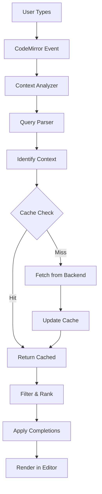

# SQL Editor Intellisense Implementation Plan

## Executive Summary

This document outlines the implementation plan for adding blazing-fast, context-aware SQL intellisense to our CodeMirror 6-based SQL editor. The solution will provide intelligent code completion that understands table aliases, query context, and database-specific functions while maintaining high performance through strategic caching and lazy loading.

### Key Features

- **Database-aware quoting**: Automatic identifier quoting based on database type (PostgreSQL `"`, MySQL `` ` ``, SQL Server `[]`, SQLite flexible)
- **Schema support**: Intelligent schema suggestions for databases that support them (PostgreSQL, SQL Server)
- **TTL-based caching**: Configurable cache expiration (5-10 minutes) with LRU eviction
- **Context awareness**: Different suggestions based on SQL clause (SELECT, FROM, WHERE, etc.)
- **Extensible design**: Reusable for single-line filter inputs and other components

## Current State Analysis

### Existing Infrastructure

- **Editor**: CodeMirror 6 with React wrapper (`@uiw/react-codemirror`)
- **SQL Support**: `@codemirror/lang-sql` with dialect support (PostgreSQL, MySQL, SQLite)
- **Backend APIs**: Complete database metadata APIs available via `databaseService.ts`
- **State Management**: Zustand stores for schema and connection management
- **Current Limitation**: Autocompletion explicitly disabled (`autocompletion: false`)

### Available Backend Services

```typescript
// Database metadata APIs ready to use:
-listDatabases(connectionId) -
  listSchemas(connectionId, database) -
  listTables(connectionId, database, schema) -
  getTableColumns(connectionId, database, schema, table) -
  listFunctions(connectionId, database, schema) -
  listTriggers(connectionId, database, schema, table) -
  tableIndexes(connectionId, database, schema, table) -
  getTableStructure(connectionId, database, schema, options);
```

## Architecture Design

### Database-Specific Features

#### Identifier Quoting Rules

```typescript
const QUOTE_CHARS: Record<DbType, QuoteConfig> = {
  PostgreSQL: {
    identifier: '"', // "table_name", "column_name"
    escape: '""', // Double the quote to escape
    needsQuoting: (name: string) => {
      return (
        /[^a-z0-9_]/.test(name.toLowerCase()) ||
        SQL_KEYWORDS.includes(name.toUpperCase())
      );
    },
  },
  MySQL: {
    identifier: "`", // `table_name`, `column_name`
    escape: "``",
    needsQuoting: (name: string) => {
      return (
        /[^a-zA-Z0-9_$]/.test(name) || SQL_KEYWORDS.includes(name.toUpperCase())
      );
    },
  },
  SQLServer: {
    identifier: ["[", "]"], // [table_name], [column_name]
    escape: "]]",
    needsQuoting: (name: string) => {
      return (
        /[^a-zA-Z0-9_@#$]/.test(name) ||
        SQL_KEYWORDS.includes(name.toUpperCase())
      );
    },
  },
  SQLite: {
    identifier: '"', // Supports ", `, or []
    escape: '""',
    needsQuoting: (name: string) => {
      return (
        /[^a-zA-Z0-9_]/.test(name) || SQL_KEYWORDS.includes(name.toUpperCase())
      );
    },
  },
};
```

#### Schema Support Matrix

```typescript
const SCHEMA_SUPPORT: Record<DbType, SchemaSupport> = {
  PostgreSQL: {
    hasSchemas: true,
    defaultSchema: "public",
    hierarchy: ["database", "schema", "table"],
    separator: ".",
    // Can reference: schema.table or database.schema.table
  },
  MySQL: {
    hasSchemas: false, // Database acts as schema
    defaultSchema: null,
    hierarchy: ["database", "table"],
    separator: ".",
    // Can reference: database.table
  },
  SQLServer: {
    hasSchemas: true,
    defaultSchema: "dbo",
    hierarchy: ["database", "schema", "table"],
    separator: ".",
    // Can reference: database.schema.table or schema.table
  },
  SQLite: {
    hasSchemas: false, // Attached databases act like schemas
    defaultSchema: "main",
    hierarchy: ["database", "table"],
    separator: ".",
    // Can reference: main.table or attached_db.table
  },
};
```

### Core Components

#### 1. Schema Cache Manager with TTL

```typescript
interface SchemaCache {
  // Hierarchical cache structure
  databases: Map<string, CacheEntry<DatabaseMeta>>;
  schemas: Map<string, CacheEntry<SchemaMeta>>;
  tables: Map<string, CacheEntry<TableMeta>>;
  columns: Map<string, CacheEntry<ColumnMeta[]>>;
  functions: Map<string, CacheEntry<FunctionMeta[]>>;

  // Cache configuration
  ttl: {
    default: number; // Default: 5 minutes (300000ms)
    databases: number; // Default: 10 minutes
    schemas: number; // Default: 10 minutes
    tables: number; // Default: 5 minutes
    columns: number; // Default: 5 minutes
    functions: number; // Default: 10 minutes
  };

  // Lazy loading flags
  loadingState: Map<string, "idle" | "loading" | "loaded" | "error">;
}

interface CacheEntry<T> {
  data: T;
  timestamp: number;
  ttl?: number; // Override default TTL
  accessCount: number; // For LRU eviction
  lastAccessed: number;
}
```

#### 2. Query Context Analyzer

```typescript
interface QueryContext {
  // Current query state
  cursorPosition: number;
  currentClause:
    | "SELECT"
    | "FROM"
    | "WHERE"
    | "JOIN"
    | "GROUP BY"
    | "ORDER BY"
    | "HAVING";

  // Table context
  tablesInScope: TableReference[];
  currentTable?: TableReference;

  // Alias mappings
  aliases: Map<string, string>; // alias -> actual table name

  // CTEs and subqueries
  ctes: Map<string, TableReference>;
  subqueries: QueryContext[];

  // Optional convenience fields used by rankers/providers
  currentSchema?: string;
  prefix?: string;
}

interface TableReference {
  schema?: string;
  table: string;
  alias?: string;
  columns?: string[]; // Available columns
  joinType?: "INNER" | "LEFT" | "RIGHT" | "FULL";
}
```

#### 3. Completion Provider System

```typescript
interface CompletionProvider {
  // Provider metadata
  priority: number;
  context: string[]; // e.g., ['SELECT', 'WHERE', 'FROM']

  // Completion generation
  getCompletions(context: QueryContext): Promise<Completion[]>;

  // Filtering and ranking
  filterCompletions(completions: Completion[], query: string): Completion[];
  rankCompletions(completions: Completion[]): Completion[];
}
```

### Data Flow Architecture



## Implementation Phases

### Phase 1: Foundation (Week 1)

#### 1.1 Setup Basic Autocomplete Infrastructure

```typescript
// src/components/CodeEditor/autocomplete/index.ts
export function createSqlAutocomplete(config: AutocompleteConfig): Extension {
  const { connectionId, dialect } = config;
  const dbType = dialectToDbType(dialect);
  const parser = new SqlQueryParser();

  const contextual = createContextualCompletionSource({
    connectionId,
    dbType,
    parser,
  });

  return autocompletion({
    override: [keywordCompletionSource, schemaCompletionSource, contextual],
    activateOnTyping: true,
    maxRenderedOptions: 50,
  });
}
```

#### 1.2 Implement Schema Cache Manager with TTL

```typescript
// src/services/schemaCache.ts
class SchemaCache {
  private cache: Map<string, CacheEntry<any>> = new Map();
  private context?: {
    connectionId: string;
    database?: string;
    schema?: string;
  };
  private readonly ttlConfig = {
    default: 5 * 60 * 1000, // 5 minutes
    databases: 10 * 60 * 1000, // 10 minutes
    schemas: 10 * 60 * 1000, // 10 minutes
    tables: 5 * 60 * 1000, // 5 minutes
    columns: 5 * 60 * 1000, // 5 minutes
    functions: 10 * 60 * 1000, // 10 minutes
  };
  private maxCacheSize = 1000; // Maximum entries before LRU eviction

  setContext(ctx: {
    connectionId: string;
    database?: string;
    schema?: string;
  }) {
    this.context = ctx;
  }

  async getSchemas(connectionId: string): Promise<SchemaMeta[]> {
    const key = `schemas:${connectionId}`;
    const cached = this.get<SchemaMeta[]>(key, this.ttlConfig.schemas);
    if (cached) return cached;
    const schemas = await databaseService.listSchemas(
      connectionId,
      this.context?.database || "",
    );
    this.set(key, schemas, this.ttlConfig.schemas);
    return schemas;
  }

  async getTables(connectionId: string, schema: string): Promise<TableMeta[]> {
    const key = `tables:${connectionId}:${schema}`;
    const cached = this.get<TableMeta[]>(key, this.ttlConfig.tables);
    if (cached) return cached;
    const tables = await databaseService.listTables(
      connectionId,
      this.context?.database || "",
      schema,
    );
    this.set(key, tables, this.ttlConfig.tables);
    return tables;
  }

  async getTableColumns(
    connectionId: string,
    schema: string,
    table: string,
  ): Promise<ColumnMeta[]> {
    const key = `columns:${connectionId}:${schema}.${table}`;
    const cached = this.get<ColumnMeta[]>(key, this.ttlConfig.columns);
    if (cached) return cached;
    const columns = await databaseService.getTableColumns(
      connectionId,
      this.context?.database || "",
      schema,
      table,
    );
    this.set(key, columns, this.ttlConfig.columns);
    return columns;
  }

  hasTableColumns(
    connectionId: string,
    schema: string,
    table: string,
  ): boolean {
    return this.cache.has(`columns:${connectionId}:${schema}.${table}`);
  }

  prefetchSchema(schema?: string): void {
    const ctx = this.context;
    if (!ctx) return;
    const s = schema || ctx.schema;
    if (!s) return;
    // trigger async but don't await
    this.getTables(ctx.connectionId, s).catch(() => void 0);
  }

  private get<T>(key: string, ttl: number): T | undefined {
    const entry = this.cache.get(key);
    if (!entry) return undefined;
    const expired = Date.now() - entry.timestamp > (entry.ttl ?? ttl);
    if (expired) {
      this.cache.delete(key);
      return undefined;
    }
    entry.lastAccessed = Date.now();
    entry.accessCount++;
    return entry.data as T;
  }

  private set<T>(key: string, data: T, ttl?: number): void {
    if (this.cache.size >= this.maxCacheSize) {
      this.evictLRU();
    }
    this.cache.set(key, {
      data,
      timestamp: Date.now(),
      ttl: ttl || this.ttlConfig.default,
      accessCount: 0,
      lastAccessed: Date.now(),
    });
  }

  private evictLRU(): void {
    let lruKey: string | null = null;
    let lruTime = Infinity;
    for (const [key, entry] of this.cache.entries()) {
      if (entry.lastAccessed < lruTime) {
        lruTime = entry.lastAccessed;
        lruKey = key;
      }
    }
    if (lruKey) this.cache.delete(lruKey);
  }

  invalidateByPrefix(prefix: string): void {
    for (const key of this.cache.keys()) {
      if (key.startsWith(prefix)) this.cache.delete(key);
    }
  }

  // Testing helpers (exposed only for validator)
  setForTest(key: string, data: any, ttl?: number) {
    this.set(key, data, ttl);
  }
  getForTest<T>(key: string): T | undefined {
    return this.get<T>(key, this.ttlConfig.default);
  }
}
```

### Phase 2: Context-Aware Completions (Week 2)

#### 2.1 SQL Query Parser

```typescript
// src/components/CodeEditor/autocomplete/parser.ts
export class SqlQueryParser {
  parseContext(state: EditorState, pos: number): QueryContext {
    const tree = syntaxTree(state);
    const node = tree.resolveInner(pos, -1);

    // Identify current clause
    const clause = this.identifyClause(node);

    // Extract table references
    const tables = this.extractTables(tree, state, pos);

    // Parse aliases
    const aliases = this.parseAliases(state.doc.toString(), tables);

    // Identify current table context
    const currentTable = this.getCurrentTable(node, tables, aliases);

    return {
      cursorPosition: pos,
      currentClause: clause,
      tablesInScope: tables,
      currentTable,
      aliases,
      ctes: new Map(),
      subqueries: [],
      currentSchema: undefined,
      prefix: undefined,
    };
  }

  private extractTables(
    tree: Tree,
    state: EditorState,
    beforePos: number,
  ): TableReference[] {
    const tables: TableReference[] = [];

    // Walk the syntax tree to find FROM and JOIN clauses
    tree.iterate({
      enter: (node) => {
        if (
          (node.name === "TableName" || node.name === "Identifier") &&
          node.from < beforePos
        ) {
          const text = state.doc.sliceString(node.from, node.to);
          tables.push(this.parseTableReference(text));
        }
      },
    });

    return tables;
  }

  private parseAliases(
    query: string,
    tables: TableReference[],
  ): Map<string, string> {
    const aliases = new Map<string, string>();

    // Regular expressions for common alias patterns
    const patterns = [
      /FROM\s+(\S+)\s+(?:AS\s+)?(\w+)/gi,
      /JOIN\s+(\S+)\s+(?:AS\s+)?(\w+)/gi,
    ];

    patterns.forEach((pattern) => {
      let match;
      while ((match = pattern.exec(query)) !== null) {
        const [, table, alias] = match;
        aliases.set(alias.toLowerCase(), table);
      }
    });

    return aliases;
  }
}
```

#### 2.2 Context-Aware Completion Sources with Auto-Quoting

```typescript
// src/components/CodeEditor/autocomplete/sources.ts
export function createContextualCompletionSource(params: {
  connectionId: string;
  dbType: DbType;
  parser: SqlQueryParser;
}): CompletionSource {
  const { connectionId, dbType, parser } = params;
  return async (context) => {
    const queryContext = parser.parseContext(context.state, context.pos);
    switch (queryContext.currentClause) {
      case "SELECT":
        return getColumnCompletions(
          queryContext,
          context,
          dbType,
          connectionId,
        );
      case "FROM":
        return getTableCompletions(queryContext, context, dbType, connectionId);
      case "WHERE":
      case "HAVING":
        return getFilterCompletions(
          queryContext,
          context,
          dbType,
          connectionId,
        );
      case "JOIN":
        return getJoinCompletions(queryContext, context, dbType, connectionId);
      case "ORDER BY":
      case "GROUP BY":
        return getGroupingCompletions(
          queryContext,
          context,
          dbType,
          connectionId,
        );
      default:
        return null;
    }
  };
}

// Auto-quoting helper
function autoQuoteIdentifier(name: string, dbType: DbType): string {
  const config = QUOTE_CHARS[dbType];

  if (!config.needsQuoting(name)) {
    return name;
  }

  if (Array.isArray(config.identifier)) {
    // SQL Server style [identifier]
    return `${config.identifier[0]}${name}${config.identifier[1]}`;
  } else {
    // Standard quoting "identifier" or `identifier`
    return `${config.identifier}${name}${config.identifier}`;
  }
}

async function getTableCompletions(
  queryContext: QueryContext,
  context: CompletionContext,
  dbType: DbType,
  connectionId: string,
): Promise<CompletionResult | null> {
  const completions: Completion[] = [];
  const schemaSupport = SCHEMA_SUPPORT[dbType];

  // Add schemas if database supports them
  if (schemaSupport.hasSchemas) {
    const schemas = await schemaCache.getSchemas(connectionId);
    schemas.forEach((schema) => {
      const quotedName = autoQuoteIdentifier(schema.name, dbType);
      completions.push({
        label: schema.name,
        apply: quotedName,
        type: "namespace",
        detail: "schema",
        boost: schema.name === schemaSupport.defaultSchema ? 10 : 0,
      });
    });
  }

  // Add tables
  const tables = await schemaCache.getTables(
    connectionId,
    queryContext.currentSchema,
  );
  tables.forEach((table) => {
    const needsQuoting = QUOTE_CHARS[dbType].needsQuoting(table.name);
    const displayName =
      schemaSupport.hasSchemas && table.schema !== schemaSupport.defaultSchema
        ? `${table.schema}.${table.name}`
        : table.name;

    const applyText = needsQuoting
      ? autoQuoteIdentifier(table.name, dbType)
      : table.name;

    completions.push({
      label: displayName,
      apply: applyText,
      type: "type",
      detail: `table (${table.row_estimate || "unknown"} rows)`,
      info: table.schema,
      boost: 0,
    });
  });

  const word = context.matchBefore(/[\w\[\]"`$]+$/);
  if (!word && !context.explicit) return null;
  const from = word ? word.from : context.pos;

  return {
    from,
    options: completions,
    validFor: /^(?:[\w\[\]"`$]+)?$/,
  };
}

async function getColumnCompletions(
  queryContext: QueryContext,
  context: CompletionContext,
  dbType: DbType,
  connectionId: string,
): Promise<CompletionResult | null> {
  const completions: Completion[] = [];

  // Add columns from all tables in scope
  for (const table of queryContext.tablesInScope) {
    const columns = await schemaCache.getTableColumns(
      connectionId,
      table.schema || SCHEMA_SUPPORT[dbType].defaultSchema,
      table.table,
    );

    columns.forEach((col) => {
      const needsQuoting = QUOTE_CHARS[dbType].needsQuoting(col.name);
      const prefix =
        table.alias ||
        (needsQuoting ? autoQuoteIdentifier(table.table, dbType) : table.table);

      const label = table.alias ? `${table.alias}.${col.name}` : col.name;
      const apply = needsQuoting
        ? `${prefix}.${autoQuoteIdentifier(col.name, dbType)}`
        : `${prefix}.${col.name}`;

      completions.push({
        label,
        apply: table.alias
          ? apply
          : needsQuoting
          ? autoQuoteIdentifier(col.name, dbType)
          : col.name,
        type: "property",
        detail: col.db_type,
        info: `${col.nullable ? "nullable" : "not null"}${
          col.is_pk ? ", PK" : ""
        }${col.is_fk ? ", FK" : ""}`,
        boost: table === queryContext.currentTable ? 10 : 0,
      });
    });
  }

  // Add aggregate functions
  completions.push(...getAggregateFunctions());

  const word = context.matchBefore(/[\w\[\]"`$]+$/);
  if (!word && !context.explicit) return null;
  const from = word ? word.from : context.pos;

  return {
    from,
    options: completions,
    validFor: /^(?:[\w\[\]"`$]+)?$/,
  };
}
```

### Phase 3: Performance Optimizations (Week 3)

#### 3.1 Intelligent Prefetching

```typescript
// src/components/CodeEditor/autocomplete/prefetch.ts
class PrefetchManager {
  private queue: Set<string> = new Set();
  private inProgress: Set<string> = new Set();

  async prefetchTableColumns(tables: TableReference[]) {
    // Batch prefetch columns for tables likely to be used
    const promises = tables.map((t) => this.prefetchTable(t));

    await Promise.allSettled(promises);
  }

  private async prefetchTable(table: TableReference) {
    const key = `${table.schema}.${table.table}`;

    if (this.inProgress.has(key)) return;

    this.inProgress.add(key);

    try {
      const schema = table.schema || "public";
      if (!schemaCache.hasTableColumns(connectionId, schema, table.table)) {
        await schemaCache.getTableColumns(connectionId, schema, table.table);
      }
    } finally {
      this.inProgress.delete(key);
    }
  }
}
```

#### 3.2 Debounced Completion Triggers

```typescript
// src/components/CodeEditor/autocomplete/triggers.ts
export function createSmartTriggers(): Extension {
  let debounceTimer: ReturnType<typeof setTimeout> | null = null;

  return EditorView.updateListener.of((update) => {
    if (!update.docChanged) return;

    // Clear existing timer
    if (debounceTimer) clearTimeout(debounceTimer);

    // Smart trigger detection
    const shouldTrigger = detectTriggerContext(update);

    if (shouldTrigger) {
      debounceTimer = setTimeout(
        () => {
          startCompletion(update.view);
        },
        shouldTrigger.immediate ? 0 : 150,
      );
    }
  });
}

function detectTriggerContext(update: ViewUpdate): TriggerConfig | null {
  const pos = update.state.selection.main.head;
  const line = update.state.doc.lineAt(pos);
  const textBefore = line.text.slice(0, pos - line.from);

  // Immediate triggers
  if (textBefore.endsWith(".")) {
    return { immediate: true }; // Table alias followed by dot
  }

  // Delayed triggers
  if (/\b(FROM|JOIN|WHERE|SELECT)\s+\w*$/.test(textBefore)) {
    return { immediate: false };
  }

  return null;
}
```

### Phase 4: Advanced Features (Week 4)

#### 4.1 Snippet Completions

```typescript
// src/components/CodeEditor/autocomplete/snippets.ts
const sqlSnippets: Completion[] = [
  snippetCompletion("SELECT ${columns} FROM ${table}", {
    label: "select",
    type: "keyword",
    detail: "SELECT statement",
  }),
  snippetCompletion("INSERT INTO ${table} (${columns}) VALUES (${values})", {
    label: "insert",
    type: "keyword",
    detail: "INSERT statement",
  }),
  snippetCompletion(
    "UPDATE ${table} SET ${column} = ${value} WHERE ${condition}",
    {
      label: "update",
      type: "keyword",
      detail: "UPDATE statement",
    },
  ),
  // Common patterns
  snippetCompletion("COUNT(DISTINCT ${column})", {
    label: "countd",
    type: "function",
    detail: "Count distinct values",
  }),
  snippetCompletion(
    "CASE WHEN ${condition} THEN ${value1} ELSE ${value2} END",
    {
      label: "case",
      type: "keyword",
      detail: "CASE expression",
    },
  ),
];
```

#### 4.2 Intelligent Ranking System

```typescript
// src/components/CodeEditor/autocomplete/ranking.ts
export class CompletionRanker {
  private usageHistory: Map<string, number> = new Map();
  private recentItems: string[] = [];

  rankCompletions(
    completions: Completion[],
    context: QueryContext,
  ): Completion[] {
    return completions
      .map((completion) => {
        let boost = completion.boost || 0;

        // Boost recently used items
        const recentIndex = this.recentItems.indexOf(completion.label);
        if (recentIndex >= 0) {
          boost += 10 - recentIndex;
        }

        // Boost by usage frequency
        const usageCount = this.usageHistory.get(completion.label) || 0;
        boost += Math.min(usageCount * 2, 20);

        // Context-specific boosts
        if (context.currentClause === "WHERE") {
          // Boost indexed columns
          if (completion.info?.includes("indexed")) {
            boost += 15;
          }
          // Boost primary keys
          if (completion.info?.includes("primary")) {
            boost += 20;
          }
        }

        // Fuzzy match quality
        const matchQuality = this.fuzzyMatchQuality(
          completion.label,
          context.prefix,
        );
        boost += matchQuality * 10;

        return { ...completion, boost };
      })
      .sort((a, b) => (b.boost || 0) - (a.boost || 0));
  }

  private fuzzyMatchQuality(label: string, prefix: string): number {
    if (!prefix) return 0;
    if (label.startsWith(prefix)) return 1;
    if (label.toLowerCase().startsWith(prefix.toLowerCase())) return 0.9;
    if (label.toLowerCase().includes(prefix.toLowerCase())) return 0.5;
    return 0;
  }

  recordUsage(item: string) {
    this.usageHistory.set(item, (this.usageHistory.get(item) || 0) + 1);

    // Update recent items
    this.recentItems = this.recentItems.filter((i) => i !== item);
    this.recentItems.unshift(item);
    this.recentItems = this.recentItems.slice(0, 20);
  }
}
```

## Integration Points

### 1. CodeEditor Component Updates

```typescript
// src/components/CodeEditor/index.tsx
import { createSqlAutocomplete } from "./autocomplete";
import { schemaCache } from "@/services/schemaCache";

export function CodeEditor(props: CodeEditorProps) {
  const { connectionId, database, schema } = props;

  // Initialize schema cache with connection context
  useEffect(() => {
    if (connectionId) {
      schemaCache.setContext({ connectionId, database, schema });
      // Prefetch common tables
      schemaCache.prefetchSchema(schema);
    }
  }, [connectionId, database, schema]);

  const extensions = useMemo(() => {
    return [
      ...getEditorExtensions(
        language,
        dialect,
        readOnly,
        lineNumbers,
        onExecute,
      ),
      createSqlAutocomplete({
        connectionId,
        dialect,
        database,
        schema,
      }),
    ];
  }, [connectionId, dialect, database, schema, ...otherDeps]);

  // Rest of component...
}
```

```typescript
// Optional: Usage tracking helper to wrap completion apply
function withUsageApply(apply: string, label: string) {
  return (
    view: EditorView,
    completion: Completion,
    from: number,
    to: number,
  ) => {
    view.dispatch({ changes: { from, to, insert: apply } });
    completionRanker.recordUsage(label);
  };
}
```

### 2. Store Integration

```typescript
// src/stores/editorStore.ts
interface EditorState {
  // Autocomplete preferences
  autocompleteEnabled: boolean;
  autocompleteDelay: number;
  maxSuggestions: number;

  // Schema context
  currentSchema: string;
  availableSchemas: string[];

  // Performance settings
  prefetchEnabled: boolean;
  cacheTimeout: number;

  // Actions
  setAutocompleteEnabled: (enabled: boolean) => void;
  updateAutocompleteSettings: (settings: Partial<AutocompleteSettings>) => void;
}
```

## Performance Targets

### Metrics

- **Initial Suggestion Display**: < 50ms for cached data
- **Network Fetch**: < 200ms for column metadata
- **Keystroke to Suggestion**: < 100ms perceived latency
- **Memory Usage**: < 10MB for typical schema cache
- **Cache Hit Rate**: > 90% for common queries

### Optimization Strategies

1. **Lazy Loading**: Only fetch metadata when needed
2. **Intelligent Caching**: LRU cache with TTL for schema data
3. **Debouncing**: Prevent excessive API calls
4. **Virtual Scrolling**: For large completion lists
5. **Web Workers**: Parse complex queries off main thread
6. **IndexedDB**: Persist cache across sessions

## Extensibility Considerations

### Plugin Architecture

```typescript
interface AutocompletePlugin {
  name: string;
  priority: number;

  // Lifecycle hooks
  onInit?(context: PluginContext): void;
  onDestroy?(): void;

  // Completion hooks
  beforeComplete?(context: QueryContext): QueryContext;
  afterComplete?(completions: Completion[]): Completion[];

  // Custom providers
  completionSource?: CompletionSource;

  // Custom parsers
  contextParser?: ContextParser;
}

// Example: Custom function completion plugin
const customFunctionsPlugin: AutocompletePlugin = {
  name: "custom-functions",
  priority: 100,

  completionSource: async (context) => {
    // Add company-specific SQL functions
    const customFunctions = await getCustomFunctions();
    return {
      from: context.pos,
      options: customFunctions.map((fn) => ({
        label: fn.name,
        type: "function",
        detail: fn.signature,
        info: fn.description,
        apply: fn.template, // Snippet template
      })),
    };
  },
};
```

### Future Extensions

1. **AI-Powered Suggestions**: Integration point for ML-based completions
2. **Query Builder Mode**: Visual query builder with generated SQL
3. **Table Data Preview**: Show sample data on hover
4. **Documentation Integration**: Inline documentation for functions
5. **Multi-Statement Support**: Handle complex scripts with multiple queries
6. **Macro System**: User-defined completion templates
7. **Cross-Database Queries**: Support for federated queries

### Single-Line Filter Inputs

The autocomplete system is designed to be reusable for single-line filter inputs in TableView and other components:

```typescript
// Example: Filter input for table data
interface FilterInputProps {
  table: string;
  onFilter: (condition: string) => void;
}

export function FilterInput({ table, onFilter }: FilterInputProps) {
  const filterExtensions = useMemo(
    () => [
      // Reuse the same autocomplete infrastructure
      createSqlAutocomplete({
        mode: "filter", // Special mode for WHERE clause only
        tables: [table], // Only suggest columns from current table
        includeOperators: true, // Add =, !=, <, >, LIKE, IN, etc.
        includeFunctions: ["COUNT", "SUM", "AVG", "MAX", "MIN"],
        snippets: [
          {
            label: "between",
            apply: "${column} BETWEEN ${value1} AND ${value2}",
          },
          { label: "in", apply: "${column} IN (${values})" },
          { label: "like", apply: "${column} LIKE '%${pattern}%'" },
          { label: "null", apply: "${column} IS NULL" },
          { label: "notnull", apply: "${column} IS NOT NULL" },
        ],
      }),
    ],
    [table],
  );

  return (
    <CodeEditor
      language="sql"
      placeholder="e.g., status = 'active' AND created_at > '2024-01-01'"
      extensions={filterExtensions}
    />
  );
}
```

This enables intelligent filtering with:

- Column name suggestions from the current table
- Operator completions after column names
- Function suggestions for aggregations
- Common filter pattern snippets
- Auto-quoting based on database type

## Validation & Testing Approach

### Manual Testing Scenarios

1. **Basic Completion**: Type table names, column names, SQL keywords
2. **Auto-Quoting**: Test with reserved keywords and special characters
3. **Schema Support**: Verify schema suggestions for PostgreSQL/SQL Server
4. **Alias Resolution**: Test `u.` completion after `FROM users u`
5. **Performance**: Monitor response times with large schemas (1000+ tables)
6. **Cache Invalidation**: Verify TTL expiration and LRU eviction

### Performance Benchmarks

```typescript
// Target metrics to validate
const PERFORMANCE_TARGETS = {
  cachedResponse: 50, // ms - Cached data retrieval
  networkFetch: 200, // ms - Backend API call
  keystrokeLatency: 100, // ms - User-perceived delay
  cacheHitRate: 0.9, // 90% cache hit rate
  memoryUsage: 10 * 1024, // KB - Max cache size
};
```

### Automated Validation

````typescript
// src/components/CodeEditor/autocomplete/validator.ts
class AutocompleteValidator {
  async validateQuoting(dbType: DbType): Promise<ValidationResult> {
    const testCases = [
      'user',        // Normal identifier
      'USER',        // Uppercase
      'select',      // Reserved keyword
      'my-table',    // Special character
      '123table',    // Starts with number
    ]

    const results = testCases.map(name => ({
      input: name,
      quoted: autoQuoteIdentifier(name, dbType),
      needsQuoting: QUOTE_CHARS[dbType].needsQuoting(name)
    }))

    return { dbType, results, passed: this.verifyQuoting(results, dbType) }
  }

  async validateCacheTTL(): Promise<boolean> {
    const cache = new SchemaCache()
    const key = 'test:item'

    // Set item with 1 second TTL
    cache.setForTest(key, { data: 'test' }, 1000)

    // Should exist immediately
    const immediate = cache.getForTest(key)
    if (!immediate) return false

    // Wait for expiration
    await new Promise(resolve => setTimeout(resolve, 1100))

    // Should be expired
    const expired = cache.getForTest(key)
    return expired === undefined
  }
}

## Migration Plan

### Phase 1: Enable Basic Autocomplete (Day 1)
1. Remove `autocompletion: false` from editor config
2. Add basic keyword completion
3. Test with existing queries

### Phase 2: Add Schema Completion (Day 2-3)
1. Implement schema cache
2. Add static schema completion
3. Test with real database connections

### Phase 3: Context Awareness (Week 2)
1. Implement query parser
2. Add context-aware completions
3. Handle table aliases

### Phase 4: Performance & Polish (Week 3)
1. Add caching layer
2. Implement smart triggers
3. Add usage-based ranking

### Phase 5: Advanced Features (Week 4)
1. Add snippet completions
2. Implement plugin system
3. Add configuration UI

## Configuration Options

```typescript
interface IntellisenseConfig {
  // Feature flags
  enabled: boolean
  contextAware: boolean
  snippetsEnabled: boolean

  // Performance
  maxSuggestions: number // Default: 50
  debounceDelay: number // Default: 150ms
  cacheTimeout: number // Default: 5 minutes
  prefetchTables: boolean // Default: true

  // Behavior
  triggersImmediate: string[] // Default: ['.']
  triggersDelayed: string[] // Default: ['FROM', 'JOIN', 'WHERE']
  acceptKeys: string[] // Default: ['Tab', 'Enter']

  // Appearance
  showTypes: boolean // Show column types
  showTableSource: boolean // Show table name for columns
  groupByType: boolean // Group suggestions by type

  // Advanced
  fuzzyMatching: boolean // Enable fuzzy search
  caseSensitive: boolean // Case-sensitive matching
  quotingStyle: 'auto' | 'always' | 'never'
}
````

## Success Metrics

1. **User Adoption**: > 80% of users enable autocomplete
2. **Completion Rate**: > 60% of suggestions are accepted
3. **Performance**: P95 latency < 200ms
4. **Accuracy**: > 90% relevant suggestions
5. **User Satisfaction**: Positive feedback in surveys

## Risk Mitigation

### Performance Risks

- **Mitigation**: Implement circuit breakers for slow queries
- **Fallback**: Disable autocomplete if performance degrades

### Data Freshness

- **Mitigation**: Implement cache invalidation on schema changes
- **Fallback**: Manual refresh option

### Complex Queries

- **Mitigation**: Graceful degradation for unparseable queries
- **Fallback**: Basic keyword completion

## Important Implementation Notes

### Database-Specific Considerations

#### PostgreSQL

- Schemas are first-class citizens - always suggest schema names
- Case-sensitive identifiers when quoted: `"User"` ≠ `user`
- Default schema is `public`
- Supports: `schema.table`, `database.schema.table`

#### MySQL/MariaDB

- No real schema concept - database = schema
- Backticks for quoting: `` `table` ``
- Can use ANSI_QUOTES mode for double quotes
- Supports: `database.table` only

#### SQL Server

- Default schema is `dbo`
- Square brackets `[table]` or double quotes for identifiers
- Four-part naming: `server.database.schema.table`
- Supports: `schema.table`, `database.schema.table`

#### SQLite

- Attached databases act as schemas
- Flexible quoting: supports `"`, `` ` ``, or `[]`
- Main database is called `main`
- Supports: `main.table`, `attached_db.table`

### Cache Invalidation Strategy

```typescript
// Automatic invalidation triggers
const INVALIDATION_EVENTS = {
  "schema-change": (ctx) =>
    cache.invalidateByPrefix(`schemas:${ctx.connectionId}`),
  "table-create": (table) =>
    cache.invalidateByPrefix(`tables:${table.connectionId}:${table.schema}`),
  "table-alter": (table) =>
    cache.invalidateByPrefix(
      `columns:${table.connectionId}:${table.schema}.${table.name}`,
    ),
  "connection-refresh": (ctx) =>
    cache.invalidateByPrefix(`${ctx.connectionId}:`),
};
```

### Performance Optimization Tips

1. **Prefetch on FROM clause**: When user types `FROM`, prefetch all table names
2. **Prefetch columns on table selection**: After table name, prefetch its columns
3. **Debounce network calls**: 150ms delay for keyword triggers
4. **Virtual scrolling**: For schemas with 100+ tables
5. **Progressive loading**: Load first 50 items, then load more on scroll

## Conclusion

This implementation plan provides a comprehensive approach to adding intelligent SQL autocomplete to our CodeMirror 6 editor. The phased approach ensures we can deliver value incrementally while building toward a sophisticated, context-aware system that matches or exceeds the capabilities of tools like BeeKeeper Studio.

The architecture is designed to be:

- **Fast**: Through intelligent caching with TTL and prefetching
- **Smart**: Through context analysis, database-specific quoting, and usage patterns
- **Database-aware**: Proper handling of schemas, quoting, and naming conventions
- **Extensible**: Through plugin architecture and reusable components
- **Maintainable**: Through modular design and clear separation of concerns

With this implementation, users will experience a dramatic improvement in their SQL editing efficiency, with intelligent suggestions that understand their query context, respect database-specific syntax, and adapt to their usage patterns.
